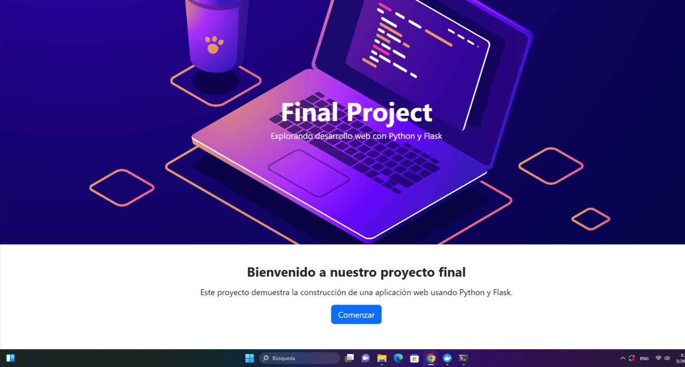
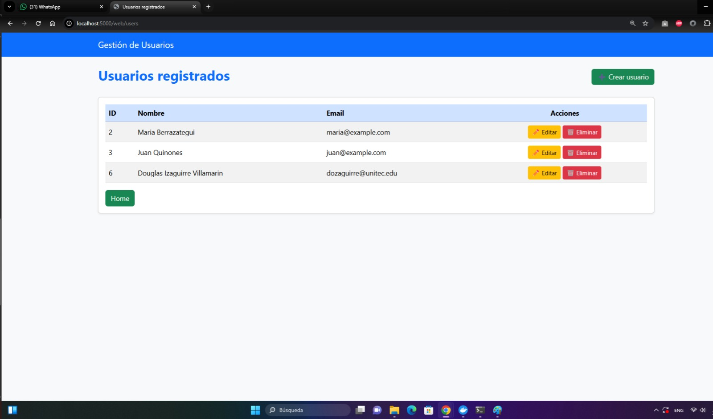

**Descripción del proyecto**

El proyecto consiste en crear una aplicación web basada en Flask, que usa un sistema CRUD (Crear, Leer, Actualizar y Borrar) para manejar usuarios a través de una API REST.

La aplicación posibilita la interacción por medio de una interfaz web básica y también por medio de endpoints HTTP, lo que hace más fácil el manejo de datos guardados en una base de datos.

**Objetivo**

Este proyecto tiene como meta principal implementar los conceptos básicos de desarrollo backend y DevOps, que incluyen:

° Creación de APIs REST usando Flask
° Aplicación de operaciones CRUD
° Uso de Docker para contenerizar
° Automatización a través de CI/CD
° Documentación técnica para profesionales

**Tecnologías Utilizadas**
° Python 3
° Flask
° SQLite / Base de datos relacional
° Docker
° Docker Compose
° GitHub Actions / CI Pipeline

**Instalación Local**
🔹 Requisitos previos
° Python 3.x
° pip
° Git

🔹 Pasos de instalación
# Clonar repositorio
git clone <repo-url>

# Acceder al proyecto
cd flask_crud

# Crear entorno virtual
python -m venv venv

# Activar entorno virtual
# Windows
venv\Scripts\activate

# Linux/Mac
source venv/bin/activate

# Instalar dependencias
pip install -r requirements.txt

# Ejecutar aplicación
python app.py

🌐 Acceso a la aplicación
http://localhost:5000

**Despliegue con Docker**
🔹 Construcción de la imagen
docker build -t flask-crud-app .
🔹 Ejecución con Docker Compose
docker-compose up

Esto iniciará:

° Aplicación Flask
° Servicios adicionales definidos 

**Arquitectura del Sistema**

El sistema sigue una arquitectura de tres capas:

             ┌──────────────┐
             │   Usuario    │
             └──────┬───────┘
                    │ HTTP Requests
                    ▼
         ┌─────────────────────┐
         │     Flask App       │
         │  (Routes / Views)   │
         └──────┬──────────────┘
                │
                ▼
         ┌─────────────────────┐
         │  Lógica de negocio  │
         │   (Modelos CRUD)    │
         └──────┬──────────────┘
                │
                ▼
         ┌─────────────────────┐
         │   Base de Datos     │
         │     (SQLite)        │
         └─────────────────────┘

**Screenshots de la aplicación**

### Página principal

### Gestión de usuarios

**Endpoints de la API**

1. Crear usuario

POST /users

Request:

{
  "name": "Juan Pérez",
  "email": "juan@email.com"
}

Response:

{
  "id": 1,
  "message": "Usuario creado correctamente"
}

2. Obtener todos los usuarios

GET /users

Response:

[
  {
    "id": 1,
    "name": "Juan Pérez",
    "email": "juan@email.com"
  }
]

3. Obtener usuario por ID

GET /users/{id}

4. Actualizar usuario

PUT /users/{id}

Request:

{
  "name": "Nombre actualizado",
  "email": "nuevo@email.com"
}

5. Eliminar usuario

DELETE /users/{id}

**Integración Continua (CI/CD)**

Este proyecto incluye un pipeline de integración continua que permite:

Validar el código automáticamente
Ejecutar pruebas
Verificar builds

Ejemplo de pipeline:
Instalación de dependencias
Ejecución del proyecto
Validación de errores

Badge del estado:

**Autores y contribuidores**
° Douglas Izaguirre -61751179
° Eduardo André Orellana Mejía -62111505
° María Cristina Lopez -62151021
° David Ricardo Flores Erazo -62121165

